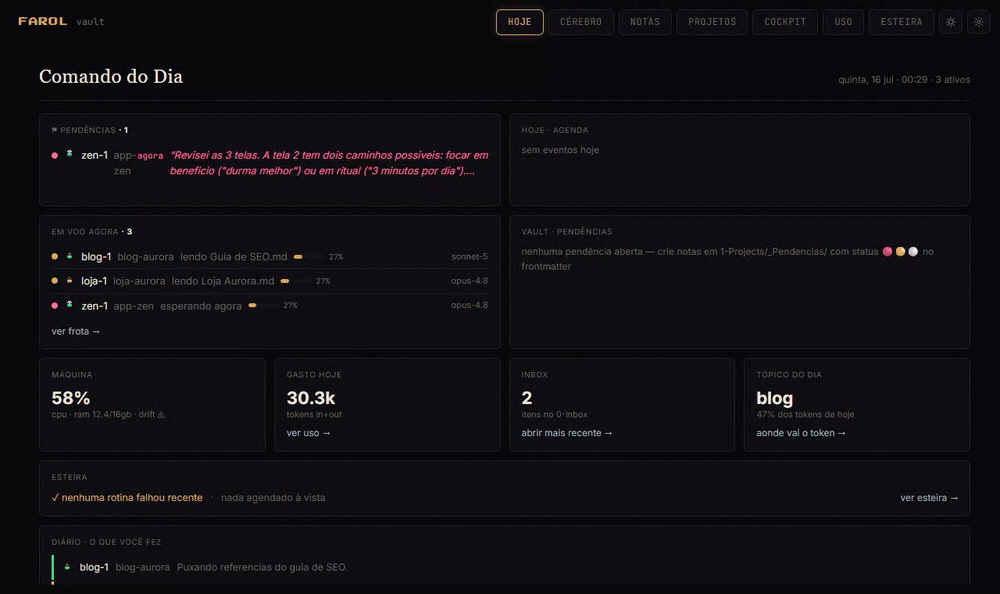

# FAROL

**Mission control for your Claude Code fleet.** (formerly "A TORRE" — the author's original tower) Watch every agent work in real time, see what they see, get pinged the second one needs you, and know exactly what each project costs. Zero instrumentation: FAROL reads the transcripts Claude Code already writes.


*Captured in demo mode (`npm run demo` shows you this exact scene). Every dot is a note, every ship is a Claude Code session. When an agent touches a file, its ship flies to that star. Nothing on screen is decoration — everything is real data happening right now.*

## Why

You don't work alone anymore. You run multiple Claude Code sessions in parallel — a team. The problem: it's an invisible team, working inside black terminals. You don't know who is working, who has been blocked for 40 minutes waiting for your answer (billing you to wait), or what the day cost.

FAROL is the lighthouse watching over that team.

## What you get

| View | What it does |
|---|---|
| **Comando** | Daily home: live sessions with context %, who is waiting for you (and for how long), today's agenda, token spend today |
| **Torre** | Your vault as a navigable 2.5D universe: folders = planets, notes = stars, sessions = ships (class by model). Dive into a galaxy and it becomes a constellation of wikilinks |
| **Cockpit** | The AI's eye: what each session is literally seeing — the browser it drives (live via CDP), the file it edits, the question it's stuck on. Plus a wall of eyes for all sessions |
| **Sala** | The same fleet as a pixel-art space station: one operator per desk, themed per project, with a "WAITING FOR YOU" board |
| **Uso** | Audited token analytics: KPIs for 7/30/90 days, stacked per project or model, top sessions, cache-economy hints |
| **Notas** | A full markdown workspace over your Obsidian vault: tree, fuzzy + semantic search, CRUD with atomic renames and inbound wikilink rewriting, `.base` and `.canvas` viewers |
| **Diário** | Automatic prose recap of your recent sessions (optional, via OpenRouter) |
| **Esteira** | Your scheduled automations with per-run stdout/stderr history |
| **Agenda / Projetos** | Calendar timeline from daily notes; project grid |

Plus: native Windows toasts when a session finishes or blocks on you, logical fleet names (`myapp-2`), light/dark themes, Ctrl+K palette, and a mobile PWA shell (point your phone at the same port over your private network).



*The Cockpit in demo mode: session `zen-1` finished its turn with a question — the question takes the stage, pink and impossible to miss.*

## How it works

- A local Node server (port 7777) watches two folders: your Obsidian vault (markdown files) and `~/.claude/projects` (the JSONL transcripts Claude Code writes per session).
- **Zero instrumentation.** No hooks, no wrappers, no proxy. It tails transcripts incrementally and derives everything: state, current action, subagents, context window, token usage. If FAROL dies, no session notices.
- "What the agent saw" is parsed from screenshots already embedded in the transcripts (indexed by byte offset, LRU-cached). The live browser eye uses a dedicated Chrome profile with CDP; without it, it degrades to frame history.
- The 2.5D universe is a hand-rolled canvas engine (no three.js) with deterministic orbits.
- Everything ships to the UI over a single SSE stream.
- **Local-first, end to end.** No cloud, no account, no telemetry. Your notes and transcripts never leave your machine.

## Quickstart

**Just looking? `npm run demo`** boots FAROL on fully synthetic data (a fictional studio's vault + fake live sessions). No setup, no Claude Code data needed — the hero GIF above is this mode.

Requirements: [Node 24+](https://nodejs.org), [Claude Code](https://claude.com/claude-code) (any usage — the transcripts are the fuel), and a folder of markdown notes (an Obsidian vault is ideal, any `.md` folder works).

**Windows (2 clicks):** download/clone the repo and double-click **`install.cmd`** — it installs everything, asks the 3 setup questions and opens FAROL in your browser. Next time, double-click `start.cmd`.

**Any platform (CLI):**

```bash
git clone https://github.com/luigiluft/farol.git
cd farol
npm install       # also installs the web app (postinstall)
npm run setup     # 3-question wizard: vault path, optional OpenRouter key, your projects
npm run build
npm start         # -> http://localhost:7777
```

`npm run setup` detects Claude Code, finds your vault (or asks), and writes `.env` + `.data/topics.json` — both gitignored, both editable by hand later (`.env.example` documents every variable). Boot prints a diagnostic ("vault ok: 1599 notes · claude ok: 238 transcripts"), also available at `GET /api/health`.

**After installing, read [docs/GUIA.md](docs/GUIA.md)** (PT-BR): what feeds each view and the optional conventions that unlock Agenda, Projetos and Pendências — most views need zero convention, some get superpowers from simple ones.

## Make it yours

FAROL personalizes itself from what Claude Code and your vault already contain — most of it is auto-detected. Here is each knob:

- **Your vault.** `npm run setup` finds your Obsidian vault (or any `.md` folder) and writes its path to `.env` as `TORRE_VAULT`; edit that line to point it anywhere. The Torre universe, Notas, search and backlinks all read from here — read-only (the Notas editor writes only where you click; deletes are soft, to a local trash).
- **Your Claude Code sessions.** Nothing to configure — FAROL tails `~/.claude/projects/*.jsonl` (override with `TORRE_CLAUDE`). Every session you run shows up as a ship automatically.
- **Your MCP servers.** Auto-detected from `~/.claude.json` and from usage in your transcripts. They appear as labeled satellites orbiting the central station in the Torre view and light up when a session calls one. Common servers (Gmail, Notion, Supabase, Context7, Figma, …) get friendly names out of the box; anything else shows by its raw id. Connect an MCP in Claude Code and it just appears — no list to maintain.
- **Your projects.** FAROL groups sessions and rooms by the top folders of `1-Projects/` in your vault. Two optional touches:
  - *Room themes* — give a project its own pixel-art station (wall + floor props + accent color) in `web/src/roomThemes.js`: add an entry with `match: ['yourproject']` and pick props from `theme-props.jsx`. Unmatched projects get a neutral station, so this never breaks.
  - *Name aliases* — when one project has a long folder name and a short topic ("My Shop Hub" vs "myshop"), map both to one key in `web/src/project-keys.js` so stats and pendências join correctly.
- **Diário prose (optional).** Add `OPENROUTER_API_KEY` to `.env` for the LLM session recaps; without it, Diário shows the mechanical summary.
- **Remote / mobile.** Serves on `localhost` only, by design. To reach it from your phone, expose the port over your own private network (e.g. Tailscale) and add a firewall rule — your call, your infra.

Everything above lives in `.env` (documented in `.env.example`) or in two small, well-commented source files. The demo (`npm run demo`) ships a worked example: a fictional studio with themed `loja` / `blog` / `zen` projects you can copy from.

## Optional features

| Feature | How to enable |
|---|---|
| Diário prose (LLM recap of sessions) | `OPENROUTER_API_KEY` in `.env` |
| Live browser eye in Cockpit | Run Chrome with a dedicated CDP profile: `scripts/chrome-cdp.cmd` (Windows) |
| Native toasts on "waiting for you" | Windows only, on by default |
| Autostart on boot | Windows: schedule `scripts/torre-autostart.mjs` as a logon task |
| Embedded local terminal | `node-pty` is an optional dependency; if it fails to build, the LOCAL tab simply disappears |

## Platform support

Built and battle-tested on **Windows 11**. The core (server, parsers, UI, universe) is plain Node + browser and is expected to work on macOS/Linux, but that path is untested — native toasts and autostart are Windows-only by design. Issue reports welcome.

**UI language is Brazilian Portuguese.** That's the tower's mother tongue; an i18n layer is on the roadmap if there's demand.

## Privacy by design

FAROL is observability over your own data, on your own machine:

- Reads your vault and your Claude Code transcripts **read-only** (the Notas editor writes only where you tell it to; deletes are soft, to a local trash).
- Serves on `localhost` only. Remote access is your call (e.g., Tailscale) and your firewall rule.
- Your config (`.env`, `.data/`) is gitignored — API keys never enter the repo.

## Roadmap (honest)

- Code-split for the ~800KB bundle
- i18n if demand shows up
- macOS/Linux verification pass

## The recursive detail

FAROL was built in a few weeks, mostly by the very agents it observes — swarms of Claude Code sessions and subagents, each delivery verified with screenshots and deterministic benches before commit. I watched them build the tower... from inside the tower.

## License

MIT © [Luigi Luft](https://github.com/luigiluft)
